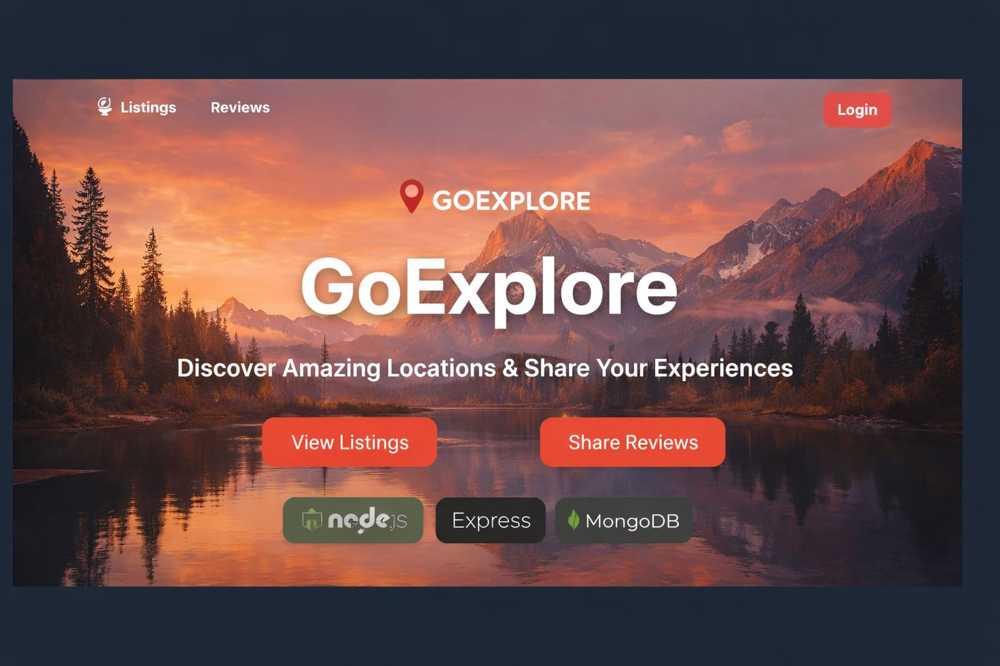

🌍 GoExplore

GoExplore is a full-stack travel listing web application where users can explore locations, view details, and share reviews. The platform allows authors to manage listings while normal users can browse and interact with the content.

---

🚀 Features

- 🔐 User Authentication (Signup / Login)
- 👤 Role-Based Access (User & Author)
- 🏞️ Browse Travel Listings
- ✍️ Add Reviews and Ratings
- 📝 Authors can Edit or Delete their Listings
- 🔒 Protected Routes for Secure Actions
- 🎨 Clean UI with EJS Templates

---

🛠️ Tech Stack

Frontend

- EJS
- Bootstrap
- CSS

Backend

- Node.js
- Express.js

Database

- MongoDB
- Mongoose

Authentication

- Passport.js
- passport-local-mongoose

---

📂 Project Structure

GoExplore
│
├── models
│   ├── listing.js
│   ├── review.js
│   └── user.js
│
├── routes
│   ├── location.js
│   └── user.js
│
├── views
│   ├── listings
│   ├── users
│   ├── includes
│   └── layouts
│
├── utils
│   ├── expressErr.js
│   └── wrapAsync.js
│
├── middleware.js
├── schema.js
├── cloudConfig.js
└── app.js

---

⚙️ Installation

Clone the repository:

git clone https://github.com/YOUR_USERNAME/GoExplore.git

Navigate into the project folder:

cd GoExplore

Install dependencies:

npm install

---

🔑 Environment Variables

Create a ".env" file in the root directory and add:

ATLASDB_URL=your_mongodb_connection_string
SECRET=your_session_secret
CLOUDINARY_KEY=your_cloudinary_key

---

▶️ Run the Project

Start the server:

node app.js

Then open your browser and visit:

http://localhost:8080

---

🎯 Future Improvements

- 📍 Map integration
- 🖼️ Image uploads
- 🔎 Search functionality
- ❤️ Favorites / Wishlist
- 📱 Responsive mobile UI

---

👨‍💻 Author

Developed by Nitin

---

📜 License

This project is open-source and available under the MIT License.
